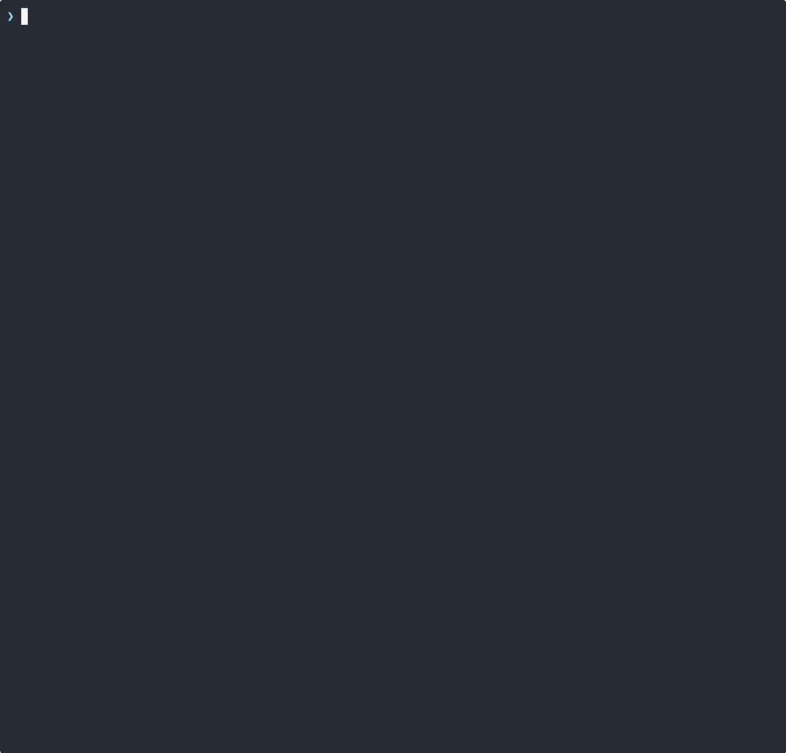

# PR Context Engine

Local-first MCP server that tracks GitHub PRs and exposes high-signal developer context to Claude. Not an API wrapper — a stateful signal engine that adds temporal awareness and relevance filtering.

## Stack

- Python 3.12, async throughout
- FastMCP (official MCP Python SDK) with SSE transport
- SQLite via aiosqlite for local state
- GitHub GraphQL API (batched queries)
- Docker for deployment

## Setup

```bash
# Ensure gh has the required scopes
gh auth refresh -s read:org,repo

# Generate .env from gh token
echo "GITHUB_TOKEN=$(gh auth token)" > .env

# Build and start the server
docker compose build
docker compose up -d
```

The server runs on `http://localhost:8321` with SSE transport. Data is persisted in a Docker named volume (`pr-data`).

## Claude Code Configuration

Add the MCP server to Claude Code:

```bash
claude mcp add --transport sse --scope user pr-context http://localhost:8321/sse
```

Note: The MCP server will only be available in new Claude Code sessions. Already running sessions will not pick it up.

## Local Development

```bash
# Install dependencies
python3 -m venv .venv
source .venv/bin/activate
pip install -e ".[dev]"

# Run MCP server locally (stdio transport)
python -m pr_context

# Run tests
pytest tests/
```

## Debug CLI

```bash
# Sync with GitHub and show new events
pr-context check

# List tracked PRs
pr-context list
pr-context list --state all

# Show unacknowledged events
pr-context events

# Delete local database
pr-context reset
```

## Configuration

| Variable | Required | Default | Description |
|---|---|---|---|
| `GITHUB_TOKEN` | Yes | — | GitHub Personal Access Token |
| `DB_PATH` | No | `./data/pr_context.db` | SQLite database path |
| `LOG_LEVEL` | No | `INFO` | Logging level |
| `TRANSPORT` | No | `stdio` | Transport: `stdio` or `sse` |
| `PORT` | No | `8321` | Port for SSE transport |

Username is auto-detected from the GitHub token via `viewer { login }`.

## MCP Tools

### `get_my_prs`

PRs you authored or are assigned to.

**Prompt:** "list my prs" / "show my open pull requests"

**Parameters:** `state` (open/closed/merged, default: open), `role` (author/all, default: author)

**Claude responds:**

> You have 1 open PR:
>
> 1. **Add rate limiting to auth endpoint** (acme/api#42) `feat/rate-limit → main`
>    - CI: passing, approved by alice, ready to merge
>    - Last comment from alice: "LGTM, just one minor nit on the retry logic"

<details>
<summary>Raw tool output</summary>

```json
[
  {
    "index": 1,
    "id": "acme/api#42",
    "repo": "acme/api",
    "number": 42,
    "title": "Add rate limiting to auth endpoint",
    "state": "OPEN",
    "url": "https://github.com/acme/api/pull/42",
    "author": "you",
    "ci_status": "SUCCESS",
    "review_decision": "APPROVED",
    "effective_review_state": "APPROVED",
    "pending_reviewers": [],
    "mergeable": "MERGEABLE",
    "merge_state_status": "CLEAN",
    "unresolved_threads": 0,
    "draft": false,
    "head_branch": "feat/rate-limit",
    "base_branch": "main",
    "updated_at": "2026-03-28T14:30:00Z",
    "last_comment": {
      "author": "alice",
      "body": "LGTM, just one minor nit on the retry logic",
      "created_at": "2026-03-28T14:30:00Z"
    }
  }
]
```

</details>

### `get_my_reviews`

PRs where you are a reviewer (excludes your own).

**Prompt:** "show my reviews" / "what prs need my review"

**Parameters:** `state` (open/closed/merged, default: open)

**Claude responds:**

> You have 1 PR to review:
>
> 1. **Refactor database connection pooling** (acme/api#38) by bob `refactor/db-pool → main`
>    - CI: failing, you requested changes yesterday
>    - New commits pushed since your review — may need another look
>    - alice has approved

<details>
<summary>Raw tool output</summary>

```json
[
  {
    "index": 2,
    "id": "acme/api#38",
    "repo": "acme/api",
    "number": 38,
    "title": "Refactor database connection pooling",
    "author": "bob",
    "ci_status": "FAILURE",
    "effective_review_state": "CHANGES_REQUESTED",
    "has_new_commits_since_review": true,
    "your_last_review_at": "2026-03-27T10:00:00Z",
    "your_last_review_state": "CHANGES_REQUESTED",
    "other_reviewers": [
      { "login": "alice", "last_state": "APPROVED", "last_at": "2026-03-28T09:00:00Z" }
    ],
    "waiting_since": "2026-03-27T10:00:00Z",
    "head_branch": "refactor/db-pool",
    "base_branch": "main"
  }
]
```

</details>

### `get_pr_details`

Full PR info including description, comments, reviews, and CI.

**Prompt:** "show details for pr #1" / "tell me about pr 42"

**Parameters:** `pr_ref` (index like "1" or full ID like "acme/api#42")

**Claude responds:**

> **Add rate limiting to auth endpoint** (acme/api#42)
> `feat/rate-limit → main` | OPEN | by you
>
> Adds token bucket rate limiting to /auth endpoints...
>
> - CI: build passing, test passing
> - Review: approved by alice
> - Mergeable, branch is clean
> - 1 comment from alice: "LGTM, just one minor nit"

<details>
<summary>Raw tool output</summary>

```json
{
  "id": "acme/api#42",
  "title": "Add rate limiting to auth endpoint",
  "state": "OPEN",
  "body": "## Summary\nAdds token bucket rate limiting to /auth endpoints...",
  "author": "you",
  "head_branch": "feat/rate-limit",
  "base_branch": "main",
  "mergeable": "MERGEABLE",
  "merge_state_status": "CLEAN",
  "comments": [
    { "author": "alice", "body": "LGTM, just one minor nit", "created_at": "2026-03-28T14:30:00Z" }
  ],
  "reviews": [
    { "author": "alice", "state": "APPROVED", "body": "", "submitted_at": "2026-03-28T14:30:00Z" }
  ],
  "ci_checks": [
    { "name": "build", "status": "COMPLETED", "conclusion": "SUCCESS" },
    { "name": "test", "status": "COMPLETED", "conclusion": "SUCCESS" }
  ]
}
```

</details>

### `get_pr_threads`

Review threads with file paths, comments, and resolution status.

**Prompt:** "show review threads on pr #1" / "any unresolved threads on pr 42?"

**Parameters:** `pr_ref`, `show_resolved` (default: false)

**Claude responds:**

> 1 unresolved thread on acme/api#42:
>
> - **src/auth/rate_limit.py:45** (unresolved)
>   - alice: "Should we make the bucket size configurable?"
>   - you: "Good call, I'll add an env var"

<details>
<summary>Raw tool output</summary>

```json
{
  "pr_id": "acme/api#42",
  "threads": [
    {
      "path": "src/auth/rate_limit.py",
      "is_resolved": false,
      "line": 45,
      "comments": [
        { "author": "alice", "body": "Should we make the bucket size configurable?", "created_at": "2026-03-28T12:00:00Z" },
        { "author": "you", "body": "Good call, I'll add an env var", "created_at": "2026-03-28T13:00:00Z" }
      ]
    }
  ],
  "total": 1,
  "unresolved": 1
}
```

</details>

### `get_pr_comments`

Top-level comments and review bodies.

**Prompt:** "show comments on pr #1"

**Parameters:** `pr_ref`

**Claude responds:**

> Comments on acme/api#42:
>
> - **alice** (2026-03-28 14:30): "LGTM, just one minor nit on the retry logic"
> - **bot** (2026-03-28 14:00): "Coverage: 94.2% (+0.3%)"
>
> Reviews:
> - **alice**: APPROVED

<details>
<summary>Raw tool output</summary>

```json
{
  "pr_id": "acme/api#42",
  "comments": [
    { "author": "alice", "body": "LGTM, just one minor nit on the retry logic", "created_at": "2026-03-28T14:30:00Z" },
    { "author": "bot", "body": "Coverage: 94.2% (+0.3%)", "created_at": "2026-03-28T14:00:00Z" }
  ],
  "reviews": [
    { "author": "alice", "state": "APPROVED", "body": "", "submitted_at": "2026-03-28T14:30:00Z" }
  ]
}
```

</details>

### `get_pr_ci`

Individual CI check details with URLs and timing.

**Prompt:** "show CI for pr #1" / "why is CI failing on pr 42?"

**Parameters:** `pr_ref`

**Claude responds:**

> CI for acme/api#42 — 1 of 2 checks failing:
>
> - **build**: passed (2m)
> - **test**: failed (5m) — [view logs](https://github.com/acme/api/actions/runs/124)

<details>
<summary>Raw tool output</summary>

```json
{
  "pr_id": "acme/api#42",
  "title": "Add rate limiting to auth endpoint",
  "overall_status": "COMPLETED",
  "checks": [
    {
      "name": "build",
      "status": "COMPLETED",
      "conclusion": "SUCCESS",
      "url": "https://github.com/acme/api/actions/runs/123",
      "started_at": "2026-03-28T14:00:00Z",
      "completed_at": "2026-03-28T14:02:00Z"
    },
    {
      "name": "test",
      "status": "COMPLETED",
      "conclusion": "FAILURE",
      "url": "https://github.com/acme/api/actions/runs/124",
      "started_at": "2026-03-28T14:00:00Z",
      "completed_at": "2026-03-28T14:05:00Z"
    }
  ],
  "summary": { "total": 2, "passed": 1, "failed": 1, "pending": 0 }
}
```

</details>

### `get_pr_updates`

Updates on PRs you authored or are assigned to. Events are acknowledged after returning.

**Prompt:** "any updates on my prs?" / "what's new on my pull requests?"

**Parameters:** `since` (reserved for future use)

**Claude responds:**

> 2 updates since you last checked (10:00 UTC):
>
> - **CI failed** on Refactor database pooling (acme/api#38) — urgent
> - alice **approved** Add rate limiting (acme/api#42)

<details>
<summary>Raw tool output</summary>

```json
{
  "events": [
    {
      "event_type": "new_review",
      "pr_id": "acme/api#42",
      "pr_number": 42,
      "repo": "acme/api",
      "actor": "alice",
      "summary": "alice reviewed Add rate limiting: APPROVED",
      "priority": 2
    },
    {
      "event_type": "ci_failed",
      "pr_id": "acme/api#38",
      "pr_number": 38,
      "repo": "acme/api",
      "actor": null,
      "summary": "CI failed on your PR: Refactor database pooling",
      "priority": 3
    }
  ],
  "total": 2,
  "acknowledged": 2,
  "last_checked_at": "2026-03-28T10:00:00Z"
}
```

</details>

### `get_review_updates`

Updates on PRs you are reviewing. Events are acknowledged separately from `get_pr_updates`.

**Prompt:** "any updates on my reviews?" / "what's changed on prs I'm reviewing?"

**Parameters:** `since` (reserved for future use)

**Claude responds:**

> 1 review update since you last checked (09:30 UTC):
>
> - carol pushed new commits to **Fix navbar styling** (acme/web#15) — may need re-review

<details>
<summary>Raw tool output</summary>

```json
{
  "events": [
    {
      "event_type": "new_commits_pushed",
      "pr_id": "acme/web#15",
      "pr_number": 15,
      "repo": "acme/web",
      "actor": "carol",
      "summary": "New commits pushed to Fix navbar styling — may need re-review",
      "priority": 2
    }
  ],
  "total": 1,
  "acknowledged": 1,
  "last_checked_at": "2026-03-28T09:30:00Z"
}
```

</details>

### `get_my_action_items`

Actionable items separated by role: things you need to do as author and as reviewer.

**Prompt:** "what needs my attention?" / "any action items?"

**Claude responds:**

> **As author:**
> - acme/api#38 Refactor database connection pooling — CI is failing
>
> **As reviewer:**
> - acme/web#15 Fix navbar styling — your review is requested

<details>
<summary>Raw tool output</summary>

```json
[
  {
    "section": "as_author",
    "pr_id": "acme/api#38",
    "number": 38,
    "repo": "acme/api",
    "title": "Refactor database connection pooling",
    "action_type": "ci_failure",
    "detail": "CI is failing"
  },
  {
    "section": "as_reviewer",
    "pr_id": "acme/web#15",
    "number": 15,
    "repo": "acme/web",
    "title": "Fix navbar styling",
    "action_type": "review_requested",
    "detail": "Your review is requested"
  }
]
```

</details>

### `summarize_my_work_context`

Full snapshot of your current work context.

**Prompt:** "summarize my work context" / "give me the full picture"

**Claude responds:**

> Here's your full work context:
>
> **Authored PRs (1):**
> - acme/api#42 Add rate limiting — CI passing
>
> **Reviewing (1):**
> - acme/web#15 Fix navbar styling — CI passing
>
> **Action items (1):**
> - Review: new commits on Fix navbar styling since your last review
>
> **Unread (1):**
> - alice approved Add rate limiting

<details>
<summary>Raw tool output</summary>

```json
{
  "user": "you",
  "authored_prs": [ { "id": "acme/api#42", "title": "Add rate limiting", "ci_status": "SUCCESS" } ],
  "reviewing_prs": [ { "id": "acme/web#15", "title": "Fix navbar styling", "ci_status": "SUCCESS" } ],
  "other_prs": [],
  "action_items": [ { "section": "as_reviewer", "action_type": "new_commits", "detail": "New commits since your last review" } ],
  "unread_events": [ { "event_type": "new_review", "summary": "alice reviewed: APPROVED", "priority": 2 } ],
  "counts": { "authored": 1, "reviewing": 1, "action_items": 1, "unread_events": 1 }
}
```

</details>

## Examples

### From action items to code fix

Asking Claude "which PRs need my attention?" surfaces unresolved review threads, merge conflicts, and new events. From there you can drill into a specific PR, see what the reviewer asked for, switch to the branch, and apply the fix — all without leaving the conversation.



### Priority System

Events and action items are assigned a priority level based on your role and urgency. **Draft PRs always have priority 0 regardless of other signals.**

| Priority | Level | As Author | As Reviewer |
|---|---|---|---|
| **3** | Urgent | CI failed, changes requested | — |
| **2** | High | New review received, approved but blocked | Review requested, re-review requested, new comments by others |
| **1** | Normal | New comments, CI passed, PR status change | — |
| **0** | Low | CI recovered, draft | Already approved, CI status change, your comment is last, draft |

Key behaviors:
- **Who commented last matters:** If you're a reviewer and your comment/review is the most recent activity, the ball is in the author's court — no action item is generated.
- **Draft override:** Any PR in draft state is always priority 0, regardless of CI, reviews, or other signals.
- **CI for reviewers:** CI status changes on PRs you're reviewing are always priority 0 — CI failures are the author's problem.

### Key Features
- PRs are referenced by index number (e.g. `#1`, `#5`) across all tools
- Smart review state: distinguishes `CHANGES_REQUESTED` from `RE_REVIEW_REQUESTED` (author re-requested review)
- Branch staleness via `merge_state_status`: BEHIND, CLEAN, DIRTY, BLOCKED, etc.
- Full comment/review/CI snapshots stored locally — last comment shown on PR summaries
- Auto-sync with 5-minute cooldown, all data cached in SQLite
- Concurrent GitHub API fetches — only changed PRs trigger detail requests
